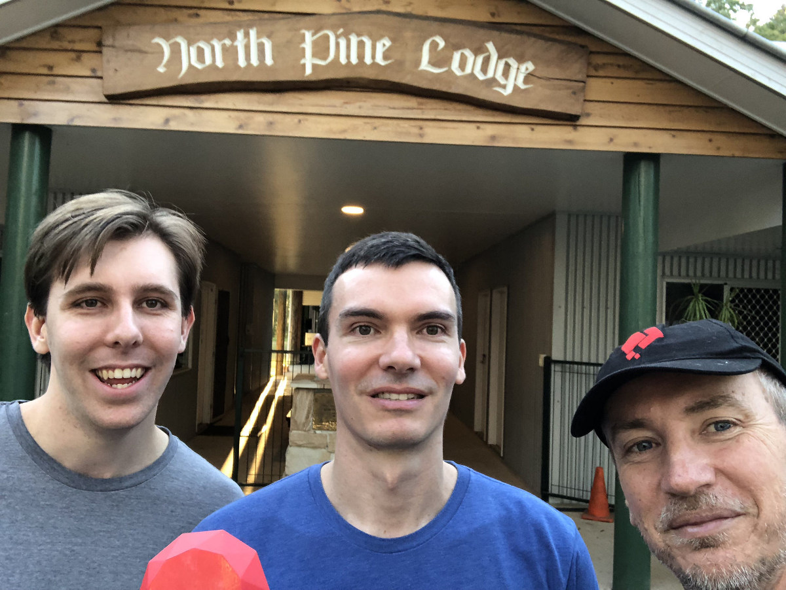
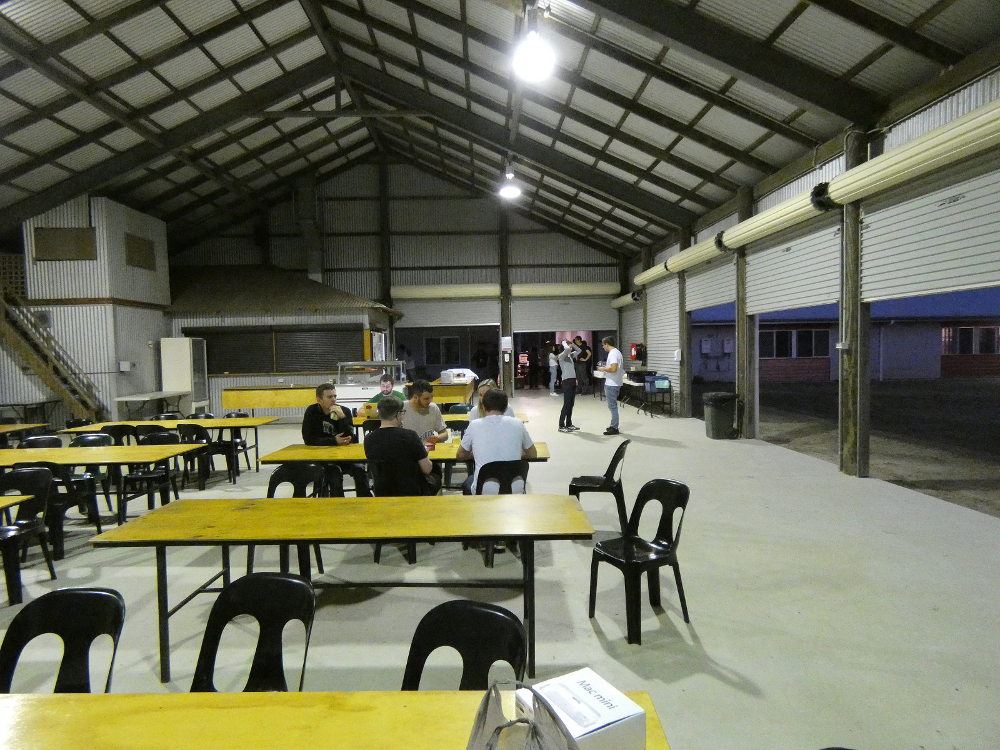
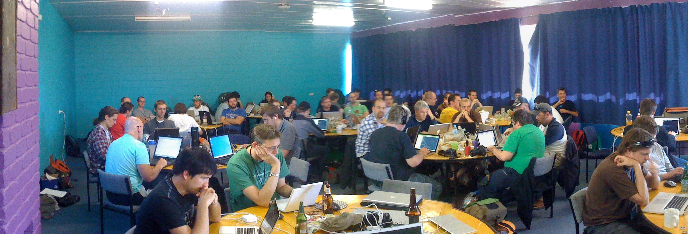
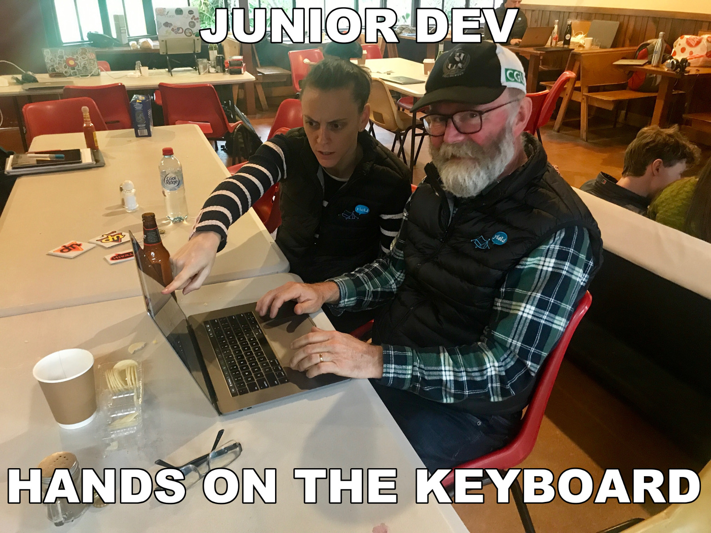

import { Head, Notes, Image } from 'mdx-deck'
import { Layout, BGImage } from './src'
import { Appear } from 'mdx-deck'
export { default as theme } from './src'

<Head>
  <title>Rails Camp 24 - Hobart Woodfield</title>
</Head>

export default Layout

# #TheRailsCampProject

<Notes>

**Selena** Hey michael,  
I've got this great idea,  
you know how we built that app to practice BDD  

**Michael** yeah  

**Selena** you know how we were going to rebuild it to affirm what we think we
know

**Michael** yeah

**Selena** and there has been general talk how the amount of coding at
railscamp seems to be on the decline  Let's kill 2 birds with 1 stone and
rebuild the app at rails camp, getting all the campers involved.

**Michael** Fuck yeah, you're a genius,  
I mean, that's a great idea but ... does everyone here know what rails camp is?

</Notes>

---

export default Layout

# What is RailsCamp?

<Notes>

**Selena**

What is Rails Camp? Great question.

Think back to your high school days. It's like a high school camp.

Bunk beds in the bush out in the middle of nowhere, often with one or two
outdoor activities - like flying fox, canoeing or hikes

Being in the middle of nowhere, there's often no internet

Sounds a bit a funny - a bunch of developers who get together and go camping
without internet

But the general idea is that people bring along their computers and a project
to work

No internet encourages people to collaborate and work through problems together

</Notes>

---

export default Layout

# What happens at RailsCamp?

<Notes>

**Michael**

opportunity to build, learn or teach something

runs around 2 times a year

The last one was in Camp Woodfield in the hills of Hobart end of November last year

</Notes>

---

export default Layout

# We love rails camp!

<Notes>

**Michael**

We are super passionate about coding

rails camp gives us an opportunity to spend undivided time on something we love
doing, we are passionate about - writing code

no kids, no preparing food, no distractions

just time to learn stuff, practice skills and share ideas with fellow
developers

I have been to over 10 rails camps and each time I come back rejuvenated from a
coding skill perspective

a bit like a meditation retreat but with code

It is also a huge opportunity to collaborate with a diverse group of developers

from juniors and people doing coder camp intensives who will be looking for
jobs in 6 months

to Tech leaders of banks and their insights

**basically: **code, sleep, eat, repeat!

</Notes>

---

export default Layout

# What we set out to do?

<Notes>

**Selena**

That's right!

And although we're super excited about being able to get away and just code for 4
days straight, not everyone shares the same view.

Two camps ago there were a lot of people who didn't write any
code, which I personally think is a wasted opportunity.

I remember when I was starting out, learning to code. I didn't want to miss any opportunity
to code - especially when there was an opportunity to code with industry experts!

After that camp, there was a lot of talk in the ruby community about the
gradual decline of coding at rails camps and a number of people seemed
generally unhappy about it. But no one seemed to have an idea of how to resolve
it

As we mentioned at the start of this presentation, Michael and I have been coding quite a bit
in our own time to try and better understand the testing processes we implement in our day job at Fresho!

The best way to understand code is to write code! So we built a game using Rails/React frameworks
And we always intended to rebuild it 3 or 4 times

</Notes>

---

export default Layout

<Notes>

[SLIDE] Jess

**Selena**

But with morning coffee one day and a sudden strike of genius - I had the idea to take the project to Rails Camp
and run through it, trippling with all teh campers.

After-all, the highest level of understanding is to be able to teach someone else and have
them understand what your talking about.

Not only would we fill our own self-ish goal of learning but we if we could manage to pair with every person at
camp, then we may also succeed in startin to set the culture of rails camp back on track with a focus of actually
coding.

**Michael**

Ultimately this would lead us to improve Fresho! processes from testing to team
collaboration and pairing

</Notes>

---

export default Layout

# What We Did!

<Notes>

[SLIDE] Keith

**Michael**

What we actually did - well this actually morphed as we went along but
basically:

paired, or trippled with every participant

what is pairing? co working on a problem with someone else 2 developers 1
keyboard

go up to person without too much intimidation and get them to work with us
bring them up to speed with context: writing a game, test driven, rails and
react

Selena would get me to get my hands off the keyboard

encourage person to write the next failing test or implement code to make a
test pass fun lolcommit

interview them about the experience

</Notes>

---

export default Layout

<Notes>

[SLIDE] Matt

**Selena**

This was not only an opportunity for me to teach more Junior people but also an
opportunity to direct more senior people and feel less intimidated by their
level of experience, knowledge etc - a hurdle that can be difficult to overcome in the workplace

I gained an incredible amount of confidence in collaborating and sharing thoughts/ideas

And (much to Michael's delight - if you've ever heard his VI talk you know what I'm talking about)
I mastered some new VI shortcuts! And have even imparted that knowledge since on avid vim users! #winning

It was also great to get a broad overview, working with a range of people.
I've had a relatively short career so far, so I hadn't really experienced what it's like to work
with such different individuals on coding problems.

</Notes>

---

export default Layout

<Notes>

[SLIDE] Laurence

**Michael**

it gave me a reason to reach out to everyone at camp

have a conversation around testing, pairing, team dynamics and developer
practices

even the people I felt intimidated by, there was no choice Selena said we have
to pair with everyone

it was intense training on how to pair with people better, I did it 36 times
and had a coach looking over my shoulder telling me where to improve after each
pairing session

We were also challenged in various ways by people and their understanding which
brought out the best in us

on how to tackle a problem

how to write a test

work collaboratively

</Notes>

---

export default Layout

# Time line after 3 commits!

<iframe frameborder="0" width="1400" height="600" src="./time-line-3-commits.html"></iframe>

<Notes>

**Selena**

By lunch time on Saturday (day 1), we got our first 3 commits in.
Starting with the most inexperienced camper there - she had never new scaffolded a rails project

</Notes>

---

export default Layout

# "don't tell me what to do"

<Notes>

[SLIDE] Edward

**Michael**

Edward was our 3'rd committer and in hind sight he changed our view on the
project and we pivoted and got on track for what the project was going to be

**Selena**

He put Michael in his Fucken place

**Michael**

the project changed from trying to write an app with the best test driven code
to being a cross cultural collabration with all 37 attendees of rails camp

this was bigger then just some code, and we hadn't realised it yet

</Notes>

---

export default Layout

# Time line till lunch Sunday

<iframe frameborder="0" width="1400" height="700" src="./time-line-till-sunday-lunch.html"></iframe>

<Notes>

**Selena**

We pushed each other and continued on, pairing with a bunch more people till we
looked up and saw everyone had gone to bed. It was 3am.

By Sunday afternoon, word got around and people got excited asking us when it
is going to be their turn and lingering around to have a go

People were more keen to pull out their laptops.

We noticed seniors who would go out of their way to help juniors which we'd
pointed out after working with us

The whole camp was buzzing for us to finish our project and get camp-wide
participation, even bringing dinner and snacks to us because there was no time
to line up for meals!

</Notes>

---

export default Layout

# Time line for weekend

<iframe frameborder="0" width="1400" height="700" src="./time-line-full-weekend.html"></iframe>

<Notes>

**Michael**

can you tell wehn we slept?

when we played werewolf?

talk to the slide - work/rest ratio

</Notes>

---

export default Layout

# We paired with 36 people

<iframe frameborder="0" width="1400" height="600" src="./images/rails_camp_committers_github.jpg"></iframe>

<Notes>

**Michael**

what does that even look like?

[SLIDE DOWN]

At Fresho it takes us around a month and a half to pair with each of the other 7 members of the team

</Notes>

---

export default Layout

## What does pairing with 36 people mean?

<ul style={{textAlign: 'left'}}>
  <Appear>
    <li>13  ... +13 ... Fresho - Aug 2017</li>
    <li>17  ...  +4 ... Meetups & last Rails Camps</li>
    <li>20  ...  +3 ... Jiffy Shirts - Jul 2017</li>
    <li>22  ...  +2 ... Pairing for Hiring</li>
    <li>28  ...  +6 ... RedBubble Boom team Jan 2017</li>
    <li>36  ...  +7 ... RedBubble various teams Oct 2015</li>
    <li><strong>Around 3 years profressional coding</strong></li>
  </Appear>
</ul>

<Notes>

[SLIDE] Anton

**Michael**

looking back at my career it has been 13 devs at Fresho

another 4 at various meetups

3 at my previous gig Jiffy Shirts

another 2 for hiring

6 at my last team at RB

another 7 or so in various teams at RB

3 years of pairing experience

and Selena and I both just got a taste of 3 years pairing experience in 1 weekend

</Notes>

---

export default Layout

 

 

<Notes>

[SLIDE]

Aaron, Kirsten, Sam

Matt, Sam, Matt

Matt, Emily, Brenton

**Michael** for Sam in the middle it was all about making our input text box
look pretty with some styling, He is also running the next rails camp

**Optional** Brenton bottom right is from culture amp and he is all about their
value "courage to be vulnerable" I hear there is a song on YouTube about him.

</Notes>

---

export default Layout

 

 

<Notes>

[SLIDE]

Rob, Rob, Rob

Paul, Tim, Tim

Selena, Jon, Cameo

**Selena** For Rob, the whole top row, it was his first experience with React,
utlitmately it turned out all about getting his lolcommit just right, we had
quite a few takes to get it right.

**Optional** Tim in the middle insisted on having a real fireside commit, with
a real fire, not everyday you get to code by a fire.

</Notes>

---

export default Layout

 

 

<Notes>

[SLIDE]

Selena, Eathan, Nick

Nadia, Pat, Bashir

Chris, Chris, Dana

**Michael** Pat, in the middle, seemed to be avoiding us? but when we found him
loitering around the chapel at 2am on Monday morning after a long game of
werewolf we knew he was ready to get down and dirty with some CSS

**Optional** Bashir, middle right, was relatively new to coding, partaking in
one of the intensive code camps. He loved the experience and we loved his
enthusiasm. It also led us to arranging a lot of the more experienced
programmers to help the juniors with their own coding problems

</Notes>

---

export default Layout

 

 

<Notes>

[SLIDE]

Erin, James, Michael

Keith, Keith, Catlin

solo, Emma, Geoffrey

**Selena** Catlin, who organised that rails camp, rails camp 24 in Hobart, was
thrilled to have everyone coding and got right into some React and snapshot
testing.

**Optional** Geoff bottom right is an ember developer so he was a bit skeptical
doing some React but he said he enjoyed it counter to what it looks like in the
lolcommit

</Notes>

---

export default Layout

 

 

<Notes>

[SLIDE]

Sonya, all, Selena

Elliot, Caroline, solo

Lauren, Drew, Sam

**Michael** all in on the commit middle top, we managed to show the rails
campers how to do Behaviour Driven Design as well

**Optional** Sam, bottom right, gave us a whole heap of his time bringing us
uptodate on reactJS testing and react-router, some 4 hours on the friday night
before the project even began, now he just avoids us :(

</Notes>

---

export default Layout

# What did we Achieve?

<Notes>

**Michael**

What did we achieve? clearly we built an awesome app with the help of all the
best developers from all the cool companies around Australia?

**Selena**

Best developers for sure! Bringing developers up to speed with our pairing practices, test
practices and the app is hard enough. let alone when you do pair swaps every 30
minutes!

**Michael**

With all these best practices we would have written great code at least?

**Selena**

haha! to write good software you actually need to plan and architect a
solution, get everyone on board and then build it at a steady pace. We did get
a lot of great pointers especially from the Up banking guys as to security
issues with our app and we learn a lot of tips and tricks from everyone.

**Michael**

Well at least we spread the message of Multi layer Outside in Behaviour Driven
Design and pairing

**Selena**

I think we did!
And we had a lot of great conversations around how we do testing and pairing and how that
compares to everyone else in their companies.

Also everyone at Rails Camp 24 in Hobart wrote some code that is committed on github! Win!

</Notes>

---

export default Layout

# What did we learn?

<Notes>

**Michael**

What did we learn?

**Selena**

That pair swaps are a necessary thing - after 36 hours pairing with you on the
weekend we were made to pair at work for the next 2 days and it wasn't pretty.

**Michael**

That they did. We also learnt how other people pair, their view on testing and
their view on developing a new feature in an app.

**Selena**

Through the weekend we also learnt a lot of "developer empathy" how to share
experiences and code with not only your coding buddy but with wider developers
that come to rails camp and that it can be done through acutall coding and not
just playing werewolf.

**Michael**

So we ultimately reached our goal of making the most of the time at rails camp
to code and share code with others, any tips?

</Notes>

---

export default Layout

# How to share coding experiences

<ul style={{textAlign: 'left'}}>
  <Appear>
    <li>build code together</li>
    <li>start the conversation</li>
    <li>be open to how others code</li>
    <li>pairing is fun
      <ul>
        <li>lolcommits</li>
        <li>https://github.com/mroth/lolcommits</li>
      </ul>
    </li>
  </Appear>
</ul>

<Notes>

sharing code can be intimidating - don't ask someone to show me your code, ask
to build together and have the experience together, as some company value
states "have the courage to be vulnerable"

Be willing to start the conversation, don't expect that somone will come to
you. Also don't be intimidated by other people in the room, everyone is happy
to code together, at least for 30 minutes.

There are a lot of tips and tricks that developers know, be open to pick these
up, be open to try new things, from new editors, workflows, key bindings,
development processess.

Have fun and try pairing, coding is not all about headphones on and sitting in
a corner and social experiences with developers do not need to be just chats,
werewolf and drinking, you can be coding at the same time.

lolcommits help with that
</Notes>

---

export default Layout

# Rails Camp 25
### May 10 - 13 Perth 

<Notes>

Next Rails camp is in 2 weeks run by our good friends Vanessa, Ceelia and Sam
and others

We won't be able to make it but we hope people make the most of all the awesome
opportunities to pair and share code.

</Notes>

---

export default Layout

# Thank You

# 

* 
Fresho!

*
* https://failure-driven.com

<Notes>

[SLIDE] Toby

**Michael**

Shout out to my daughter Matilda for our awesome werewolf
t-shirts from a couple of rails camps ago! follow us on twitter wher I am
@saramic

**Selena**

and I am @selenasmall88 alternately find our posts on our blog failure-driven
or by looking at the hash tag #TheRailsCampProject on twitter

**Michael**

we both work for Fresho who have been super supportive in us going to Rails
Camps as well as chipping in for diversity tickets.

**Selena**

Thanks for listening, hope you enjoyed!

</Notes>
