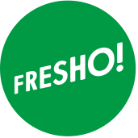

import { Head, Notes, Image } from 'mdx-deck'
import { Layout, BGImage } from './src'
import { Appear } from 'mdx-deck'
export { default as theme } from './src'

<Head>
  <title>Rails Camp 24 - Hobart Woodfield</title>
</Head>

export default Layout

# #TheRailsCampProject

<Notes>

**Selena** Hey michael,  
I've got this great idea,  
you know how we built that app to practice BDD  

**Michael** yeah  

**Selena** you know how we were going to rebuild it to affirm what we think we
know

**Michael** yeah

**Selena** and there has been general talk how the amount of coding at
railscamp seems to be on the decline  Let's kill 2 birds with 1 stone and
rebuild the app at rails camp, getting all the campers involved.

**Michael** Fuck yeah, you're a genius,  
I mean, that's a great idea but ... does everyone here know what rails camp is?

</Notes>

---

export default Layout

# What is RailsCamp?

<Notes>

**Selena**

Think back to your high school days. It's like a high school camp.

Bunk beds in the bush out in the middle of nowhere, often with one or two
outdoor activities - like flying fox

Being in the middle of nowhere, there's often no internet

Sounds a bit a funny - a bunch of developers who get together and go camping
without internet

But the general idea is that people bring along their computers and a project
to work

No internet encourages in person sharing and collaboration among peers

</Notes>

---

export default Layout

# What happens at RailsCamp?

<Notes>

**Michael**

opportunity to build, learn or teach something

runs around 2 times a year

The last one was in Camp Woodfield in the hills of Hobart end of November last year

</Notes>

---

export default Layout

# We love rails camp!

<Notes>

**Michael**

We are super passionate about coding

rails camp gives us an opportunity to spend undivided time on something we love
doing, we are passionate about - writing code

no kids, no preparing food, no distractions

just time to learn stuff, practice skills and share ideas with fellow
developers

I have been to over 10 rails camps and each time I come back rejufinated from a
coding skill perspective

a bit like a meditation retreat but to energise me to code better at work

It is also a huge opportunity to collaborate with a diverse group of developers

from juniors and people doing coder camp intensives who will be looking for
jobs in 6 months

to Tech leaders of banks and their insights

as well as connections in companies like buildKite who we would most likely
move to to imporove our build processess

and connections from 2redKites about our use of ember.

**basically: **code, sleep, eat, repeat!

</Notes>

---

export default Layout

# What we set out to do?

<Notes>

**Selena**

Although we are super excited about being able to get away and just code for 4
days straight at the last camp there were a lot of people who didn't write any
code, which I personally think is a wasted opportunity.

After that camp, there was a lot of talk in the ruby community about the
gradual decline of coding at rails camps and a number of people seemed
generally unhappy about it. But no one seemed to have an idea of how to resolve
it

Michael and I have been coding a bit outside of work to try and better
understand the testing processes we use on the dev team at Fresho! To try and
understand that, we've built a game using technologies we use here and given a
talk about it locally. However, to understand that better we always intended to
rebuild our game a 3 or 4 more times.

</Notes>

---

export default Layout

<Notes>

[SLIDE] Jess

**Selena**

We wanted to go to Rails camp and run through how to build the game as a
workshop during the weekend.

And then a week before we went I had this ridiculous idea. I figured we could
kill two birds with one stone, not only rebuilding the game but also pairing
with other people at rails camp to do it.

The highest level of understanding is to be able to teach someone else and have
them understand what your talking about.

We would not only gain that but if we could manage to pair with every person
there, then we could also start to set the culture of rails camp back on track
with a focus of actually coding.

By collaborating with a bunch of other developers who we don't usually work
with, this also gave us an opportunity to test how good the culture is on
Fresho's dev team, how we can share it, and how we can improve it

**Michael**

Ultimately this would lead us to improve Fresho! processes from testing to team
collaboration and pairing

</Notes>

---

export default Layout

# What We Did!

<Notes>

[SLIDE] Keith

**Michael**

What we actually did - well this actually morphed as we went along but
basically:

paired, or trippled with every participant

what is pairing? co working on a problem with someone else 2 developers 1
keyboard

go up to person without too much intimidation and get them to work with us
bring them up to speed with context: writing a game, test driven, rails and
react

Selena would get me to get my hands off the keyboard

encourage person to write the next failing test or implement code to make a
test pass fun lolcommit

interview them about the experience

</Notes>

---

export default Layout

<Notes>

[SLIDE] Matt

**Selena**

opportunity to teach more Junior people (not something that will likely happen
at Fresho in the next 2 years but something that is proven to help individuals
excel - great for our dev team too. ie only as strong as your weakest link)

opportunity to direct more senior people and feel less intimidated by their
level of experience, knowledge etc

Gain so much more confidence in collaborating and sharing thoughts/ideas

VI shortcuts - got them down.

It was also great to get a broad overview, working with a wider range of
people. I've had a relatively short career so far, so I hadn't really
experienced what it's like to work with such different individuals on coding
problems.

</Notes>

---

export default Layout

<Notes>

[SLIDE] Laurence

**Michael**

it gave me a reason to reach out to everyone at camp

have a conversation around testing, pairing, team dynamics and developer
practices

even the people I felt intimidated by, there was no choice Selena said we have
to pair with everyone

it was intense training on how to pair with people better, I did it 36 times
and had a coach looking over my shoulder telling me where to improve after each
pairing session

We were also challenged in various ways by people and their understanding which
brought out the best in us

on how to tackle a problem

how to write a test

work collaboratively

</Notes>

---

export default Layout

# Time line after 3 commits!

<iframe frameborder="0" width="1400" height="600" src="time-line-3-commits.html"></iframe>

<Notes>

**Selena**

With the project under way, we got our first 3 commits by lunch time on the
Saturday, starting with the most inexperienced camper there - she had never
scaffolded a new rails project

</Notes>

---

export default Layout

# "don't tell me what to do"

<Notes>

[SLIDE] Edward

**Michael**

Edward was our 3'rd committer and in hind sight he changed our view on the
project and we pivoted and got on track for what the project was going to be

**Selena**

He put Michael in his Fucken place

**Michael**

the project changed from trying to write an app with the best test driven code
to being a cross cultural collabration with all 37 attendees of rails camp

this was bigger then just some code, and we hadn't realised it yet

</Notes>

---

export default Layout

# Time line till lunch Sunday

<iframe frameborder="0" width="1400" height="700" src="time-line-till-sunday-lunch.html"></iframe>

<Notes>

**Selena**

We pushed each other and continued on, pairing with a bunch more people till we
looked up and saw everyone had gone to bed. It was 3am.

By Sunday afternoon, word got around and people got excited asking us when it
is going to be their turn and lingering around to have a go

People were more keen to pull out their laptops.

We noticed seniors who would go out of their way to help juniors which we'd
pointed out after working with us

The whole camp was buzzing for us to finish our project and get camp-wide
participation, even bringing dinner and snacks to us because there was no time
to line up for meals!

</Notes>

---

export default Layout

# Time line for weekend

<iframe frameborder="0" width="1400" height="700" src="time-line-full-weekend.html"></iframe>

<Notes>

**Michael**

can you tell wehn we slept?

when we played werewolf?

talk to the slide - work/rest ratio

</Notes>

---

export default Layout

# We paired with 36 people

<iframe frameborder="0" width="1400" height="600" src="images/rails_camp_committers_github.jpg"></iframe>

<Notes>

**Michael**

what does that even look like?

[SLIDE DOWN]

At Fresho it takes us around a month and a half to pair with each of the other 7 members of the team

</Notes>

---

export default Layout

## What does pairing with 36 people mean?

<ul style={{textAlign: 'left'}}>
  <Appear>
    <li>13  ... +13 ... Fresho - Aug 2017</li>
    <li>17  ...  +4 ... Meetups & last Rails Camps</li>
    <li>20  ...  +3 ... Jiffy Shirts - Jul 2017</li>
    <li>22  ...  +2 ... Pairing for Hiring</li>
    <li>28  ...  +6 ... RedBubble Boom team Jan 2017</li>
    <li>36  ...  +7 ... RedBubble various teams Oct 2015</li>
    <li><strong>Around 3 years profressional coding</strong></li>
  </Appear>
</ul>

<Notes>

[SLIDE] Anton

**Michael**

looking back at my career it has been 13 devs at Fresho

another 4 at various meetups

3 at my previous gig Jiffy Shirts

another 2 for hiring

6 at my last team at RB

another 7 or so in various teams at RB

3 years of pairing experience

and Selena and I both just got a taste of 3 years pairing experience in 1 weekend

**Selena**

Like I mentioned earlier, this was massive for me - I just caught up on 3 years
of certain aspects of industry experience. And any time any one of us levels
up, the whole team levels up.

</Notes>

---

export default Layout

 

 

<Notes>

[SLIDE]

Aaron, Kirsten, Sam

Matt, Sam, Matt

Matt, Emily, Brenton

</Notes>

---

export default Layout

 

 

<Notes>

[SLIDE]

Rob, Rob, Rob

Paul, Tim, Tim

Selena, Jon, Cameo

</Notes>

---

export default Layout

 

 

<Notes>

[SLIDE]

Selena, Eathan, Nick

Nadia, Pat, Bashir

Chris, Chris, Dana

</Notes>

---

export default Layout

 

 

<Notes>

[SLIDE]

Erin, James, Michael

Keith, Keith, Catlin

solo, Emma, Geoffrey

</Notes>

---

export default Layout

 

 

<Notes>

[SLIDE]

Sonya, all, Selena

Elliot, Caroline, solo

Lauren, Drew, Sam

</Notes>

---

export default Layout

# What did we learn?

<ul style={{textAlign: 'left'}}>
  <Appear>
    <li>build code together</li>
    <li>start the conversation</li>
    <li>try to pick up the tips</li>
    <li>have fun</li>
    <li>lolcommits </li>
  </Appear>
</ul>

<Notes>

**Michael** It can be intimidating to share code, trust us we shared our code
with plenty of people. It is even more intimidating to ask someone to show
their code, Selena can I see your code?

**Selena** no way! the easiest way is to build code together, you will both
learn new ideas and approaches and any critique of the code will be in the
knowledge that you just tried hardest to write it

[next]

**Selena** be willing to start the conversation

**Michael** sure it may look easy for the 2 of us egging each other on to go
and chat with someone, build repoire and share code, trust us it is not always
easy but always rewarding

- Pairing
  - we were surprised at the variety of pairing ideas
  - a lot of people don't pair :(
  - pair with juniors or just to nut out a problem
  - we believe in co-creative output as pairing
  - don't wear out your pair
  - a lot of people are control freaks
  - only pair for learning
  - many miss the point that the whole can be greater then the sum of the
    parts.
- Testing
  - people need more guidance in that
- Working on master
  - lots of opinions - most didn't agree with ours
- Technology
  - a diverse understanding and interest, being web app developers using Ember
    we couldn't wait to get our hands on react but lot's of others were
    treating it like just another fad
- Encouragement
  - amazaing how peopel where intimidated by us
  - we were intimidated by lot's of others
  - our finding? "dont' be" we are all nice people
  - one of the best way is to co-create some code, less intimidating then
    asking to see someone elses code, this way you are also in full
    understanding why something was written, not judgmental, it unfolds in
    front of you.

- courage to be vulnerable - with meeting people with sharing your code
- bring your code to others
- pairing for learning
- insight into testing, pairing, different companies
- so much to learn - be open to pick up tips and tricks
- for next time: share your code, don't wait for others to start the
  conversation, talk in code - encourage others to type

</Notes>

---

export default Layout

# Thank You

# 

* 
Fresho!

*
* https://failure-driven.com

<Notes>

[SLIDE] Toby

**Michael**

Thank you all, shout out to my daughter Matilda for our awesome werewolf
t-shirts from a couple of rails camps ago! follow us on twitter wher I am
@saramic

**Selena**

and I am @selenasmall88 alternately find our posts on our blog failure-driven
or by looking at the hash tag #TheRailsCampProject on twitter

**Michael**

we both work for Fresho who have been super supportive in us going to Rails
Camps as well as chipping in for diversity tickets.

**Selena**

And if you want to see our next talk it is on wednesday in a week, in the US at
RailsConf - but I am sure we will be back

</Notes>
